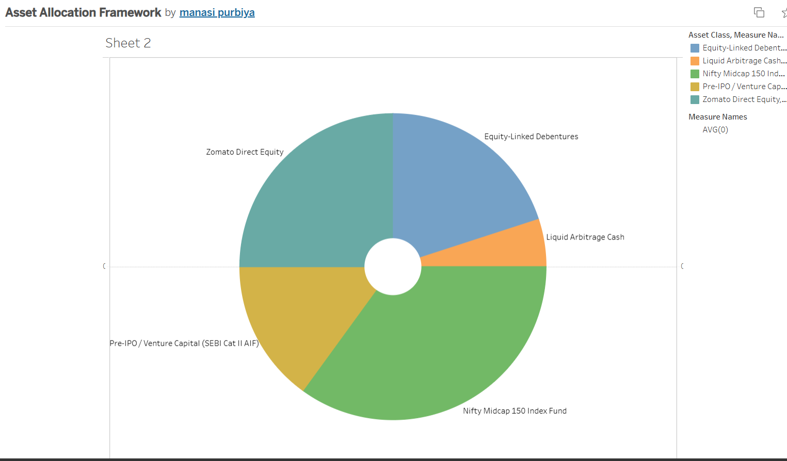

# ZOMATO_VALUATION_WEALTH_PIPELINE
# Automated Valuation & Institutional Wealth Management Pipeline

An end-to-end financial data pipeline that automates an intrinsic valuation of Zomato Ltd and structures a multi-asset portfolio for an Indian UHNW family office.

## 🚀 Live Project Ecosystem
* **Automated Python Script:** [Click Here for Google Colab Link](https://colab.research.google.com/drive/1qesntxz9zSyUF3d4xL5iEGV_OSTFJcaq?usp=sharing)
* **Interactive Frontend Client Dashboard:** [Click Here for Live Tableau Dashboard Link](https://public.tableau.com/views/AssetAllocationFramework/Sheet2?:language=en-US&publish=yes&:sid=&:redirect=auth&:display_count=n&:origin=viz_share_link)

### 📊 Client Asset Allocation Model Interface
*Click on the dashboard image below to view and interact with the live charts, dynamic tooltips, and real-time asset exposures on Tableau Public:*

## 🛠️ Project Architecture
1. **Investment Banking Track (DCF Valuation):** Built an automated 3-year forecasting pipeline using target growth vectors (35% topline CAGR driven by Blinkit scale). Applied a 12% WACC hurdle rate and 5% Terminal Growth Rate to derive an intrinsic target price.
2. **Private Wealth Track (Asset Allocation):** Formulated an institutional-grade, risk-adjusted ₹100M aggressive portfolio layout, deploying capital across high-alpha domestic equities (Nifty Midcap 150), SEBI Category II Alternative Investment Funds (AIFs), and structured Equity-Linked Debentures.
